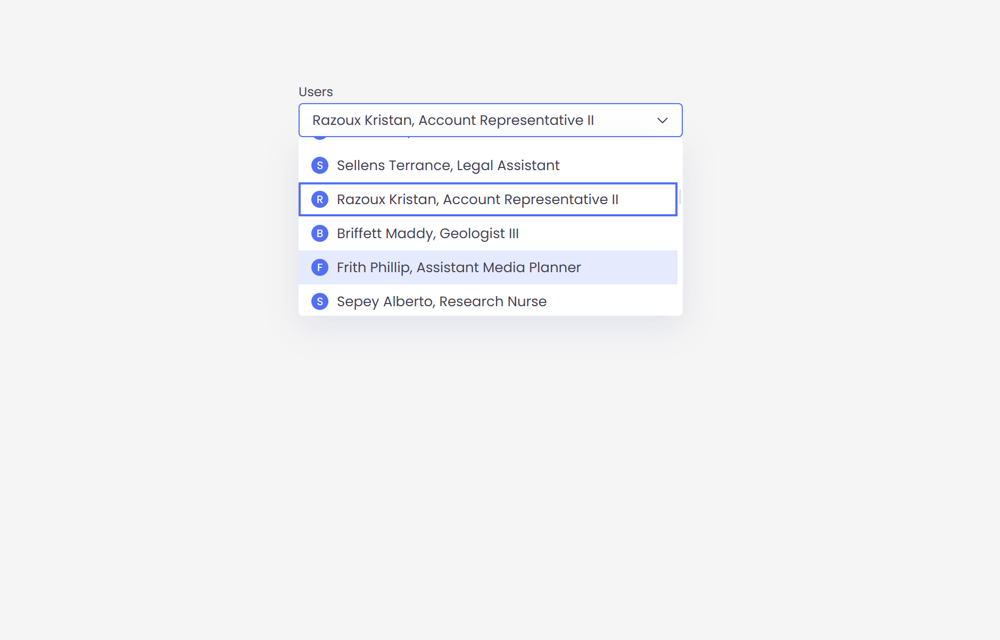

# "Select Component" Test Project

## Description

### A custom React select component

### Features

- Code written in TypeScript
- Icon, Last Name, First Name, Job Title for each user in the list
- 50 records downloading from API for user triggered events
- No third-part libraries except React & TypeScript

### Dependencies

1. `Vite`
2. `React` • `TypeScript`
3. `API`

## Installation & Execution

### Install via Vite:

```
  git clone https://github.com/mirzaianov/test-select.git
  cd test-select
  npm install
```

### Run in the development mode:

```
  npm run dev
```

Vite will start the frontend server on http://localhost:5173/

### Or open the deployed site:

https://select-mirzaianov.vercel.app/

## License

### MIT license

You can use the code, but I ask you do not copy this site without giving me credit
